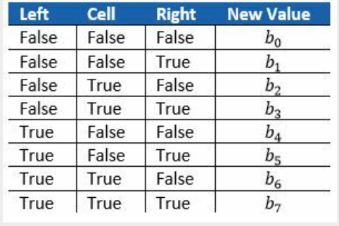

# Linear-Cellular-Automata

This reads the description of an automation (including initial configuration) from the standard 
input, and then computes and displays a specified number of generations. The input is specified 
as follows (all items mentioned need to be seperated by white space):

- The letter A, B, or U indicating the type of automaton to be executed.
- A positive integer L being the number of cells of the automaton.
- A positive integer G being the number of generations to be computed and displayed (including 
  the initial configuration).
- The word init_start, followed by one or more positive integers, followed by the word init_end. 
  The integers are the positions of the occupied cells in the initial configuration (the first cell in the grid has position 1). All other cells are empty in the initial configuration. When an integer is higher than the number of cells L it should be ignored.
- In case of automaton type U (universal automaton) 8 0's and 1's representing the Boolean values 
  b0, b1, …, b7 mentioned in the description of the rule set for a universal automaton above (0 representing false, 1 representing true).

Command line examples
---------------------

Syntax:

[A,B or U] L G [U-Integer] init_start [1 or more positive integers] init_end

Type A rule Examples:
```cpp
A 11 10 init_start 6 init_end
A 100 50 init_start 10 50 90 init_end
```
An automaton of type A has the following fixed rule set:
- If a cell is currently occupied, it remains occupied only if exactly one neighbor is occupied.
- If a cell is currently empty, it remains empty only if both neighbors are empty.

Type B rule Examples:
```cpp
B 61 40 init_start 20 40 init_end
B 104 50 init_start 35 51 83 init_end
```
An automaton of type B has the following fixed rule set:
- If a cell is currently occupied, it remains occupied only if the right neighbor is empty.
- If a cell is currently empty, it becomes occupied if exactly one neighbor is occupied.

Type U rule Examples:
```cpp
U 11 10 90 init_start 1 6 11 init_end
U 50 20 30 init_start 25 init_end
```
For an automaton of type U (called a universal automaton) the rule set is defined by a table of the following form (where boolean values true and false are used to indicate the occupied and empty state, respectively):



Link to the challenge:
[https://mailing.demcon.com/lp/decode-demcon-linear-cellular-automata](https://mailing.demcon.com/lp/decode-demcon-linear-cellular-automata)